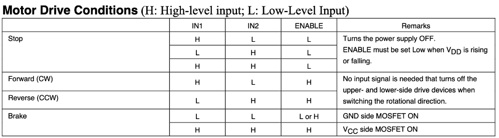

# AMP PCB version 2

This PCB attempts to refine the v1 PCB to strip away extraneous components and achieve the best minimal set of components needed for drive, steering, and braking control

## Minimal Feature Set

- 0-12 volt analog throttle signal
- digital drive mode control (12 volt logic level)
  - Foot switch (FS1)
  - Forward (FWD)
  - Reverse (REV)
- 12 volt frequency modulated PWM steering signal
  - //TODO: ADD THE FREQUENCY BOUNDS OF FULL LEFT AND FULL RIGHT
- digital brake control (5 volt logic level //FIXME: IS THIS CORRECT?, CHECK IF THIS IS LEVEL SHIFTED ON CURRENT BOARD)
  - 

## Extensions

- E-Brake
- Remote control

## Notes (to check)

- Throttle differential amplifier
  - Check if gain can be larger/smaller than 3.63 (for resistor selection)
  - Low pass filter for PWM->analog signal
- Motor controller
  - Add breakout pins when PCB ordered/tested
- FTDI breakout (check if needed for Teensy)
- Feather
  - Remote control pins
- Connectors
  - Test point connectors
  - Signal out connectors (talk to electrical)